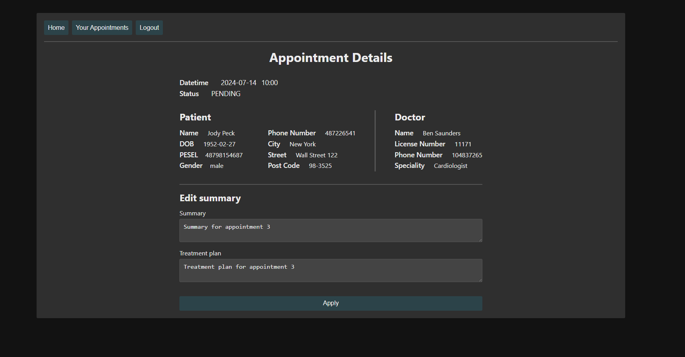

# Virtual Clinic

## General
The prototype of the virtual clinic web app, developed for Security of Medical IT Systems course at the WUT. The app offers services for multiple roles - Patient, Doctor and Staff/Receptionist. The backend is built on Spring Boot, while the frontend is developed using React JS (communication based on REST API) and HTML/CSS. MySQL serves as the database for storing application data. Security things are implemented "from stratch" (i.e. no security frameworks).


## Installation
The app is contenerized with docker so you can deploy the application on your own computer if you have docker-compose tool.
1. Clone the repo 
```
git clone https://github.com/ksalekk/virtual-clinic.git
```
2. You can change port bindings for specified services in ./.env file (default: 8080 backend, 3000 frontend, 3366 database)
3. Run containers defined in ./docker-compose.yaml
```
docker-compose -f ./docker-compose.yaml up
```

This app have a few predefined users. You can log in as a:
- patient  (L: patient1   H: patient1)
- doctor   (L: doctor1    H: doctor1)
- staff    (L: staff1     H: staff1)


## Features
***
User with any role can log in and patient user can sign up; other functionalities are designed for specified role.

***
Patient can edit own personal data and see own appointments.

***
Doctor can see own appointments and edit some of things for specified appointment (e.g. summary description). 

***
Staff/Receptionist can see all doctors and patients in system and add new appointment for specified patient and doctor.

***


## Architecture and Security

Authentication is based on basic HTTP authentication - credentials are encoded in base64 and are transferred in HTTP header from client to server. Backend decodes credentials, computes hash (SHA-256) for decoded password and compares with password hash from the database. If authentication is successful, backend returns HTTP response with specified Set-Cookie header and principal body (user id and role). Session is stored with HttpOnly cookie for client side and in HttpSession for backend side (in Spring context).

Authorization is implemented with use Spring filters that processing every http request before it will reach DispatcherServlet. Decision about accepting/rejecting request is taken based on user role and target endpoint. Authorization filter is whitelisting oriented and it uses AuthGuard object to check if specified request can access the resource. However REST API must also prevent from getting access to user B resource by user A with the same role (Insecure Direct Object Reference), so additional layer was implemented at the lowest cost, i.e. in controllers (in the real system it might be better to implement it with Spring aspects).


